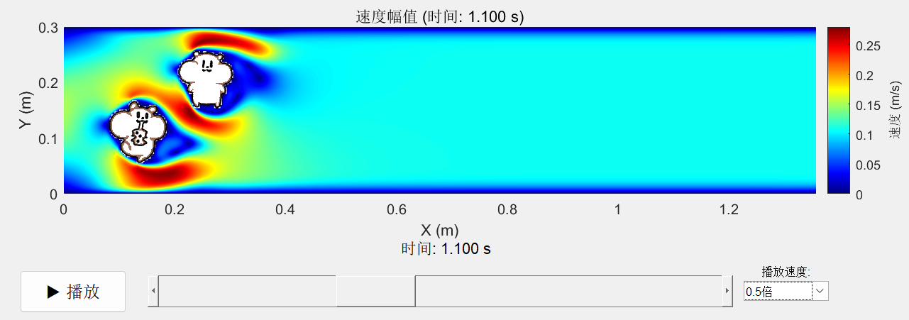

# CFDRAT: 三分钟上手的流体仿真平台 
[]()

<p align="center">
  
  
  <br>
  <em>绕流</em>
</p>

 **CFDRAT**是一个用MATLAB编写的用户友好CFD求解器，旨在让流体力学仿真变得快速且有趣。在这里，不需要复杂的操作，只需要一张图片，即可在短时间内完成仿真。

该仿真平台主要针对规则区域内的层流。出于个人兴趣创作，仅用于娱乐与教学。
## 主要特点

-   **快速上手:** 自带GUI，使用简单

-   **几何提取:** 根据图片，自动提取物体边界并生成网格。

-   **交互式后处理:** 内置动画播放器，支持播放/暂停、时间轴拖动和播放速率调整。


## 快速复现以上的绕流

想生成这个有趣的物理现象吗？操作很简单：

1.  **环境要求:** 安装MATLAB R2020b 或更高版本。

2.  **下载项目:** 通过 `git clone` 或直接下载ZIP包的方式，获取本仓库的全部
文件。

3.  **运行程序:** 打开MATLAB，将路径切换到本项目所在的文件夹 `CFDRAT/`，然后在命令行输入以下命令并回车：
  ```matlab
cfdrat()
```
4.  **开始仿真**：此时，程序的GUI界面会自动打开，并且已经填好了该示例的所有参数。只需直接点击 “开始仿真” 按钮。

<p align="center">
  
</p>


5.  **欣赏结果**：程序将自动进行网格划分、计算和求解。大约3分钟后完成，并弹出交互式动画播放窗口。


## 如何定义自己的场景

模拟任何你感兴趣的场景，仅需一张图片。以下是从输入图片到结果可视化的步骤。

1.  在GUI界面左侧的 **“障碍物图像”** 区域，点击 **`浏览...`** 按钮，选择您自己的图片以载入物体。计算域原点默认为图片左下角。

<p align="center">
  
</p>

2.  根据需要，在交互界面调整 “计算域高度”、“入口速度” 和 “流体粘度”等参数，以调整流体环境。计算域长度、障碍位置等信息自然随图片长宽比决定。

3.  指定保存位置：点击 **“结果保存位置”** 右侧的 **`选择...`** 按钮，指定一个文件夹，并且预先输入数据文件名，以存放本次仿真的结果数据（`.mat`文件）。

4.  网格检查：点击 **“开始仿真”** 按钮，程序会自动生成网格，用户可以检查，决定是否继续进行仿真。

<p align="center">
  
</p>

5. 开始计算：确认后程序将开始计算，可以在命令栏看到进度提示。大规模计算需要一些时间，请耐心等待。

6. 可视化：仿真成功结束后，程序会弹出交互式动画播放器，展示的计算结果。

<p align="center">
  
</p>

###  如何加载以往的仿真结果


1.  在GUI界面右侧的 **“结果可视化”** 区域，点击“数据文件”旁的 **`浏览...`** 按钮。

2.  在弹出的窗口中，找到并选择您之前保存的结果数据文件（它是一个 `.mat` 文件）。

3.  点击蓝色的 **“播放动画”** 按钮，程序将加载数据并展示对应的流场动画。


## 技术架构


-   求解算法：PISO。
-   空间离散化：基于有限差分法，使用交错网格与二阶迎风离散格式
-   障碍边界处理：阶梯逼近。
-   求解器：采用预条件的稳定双共轭梯度法与共轭梯度法

## 深入了解
 
供参考的使用细节
 
*   ➡️ **[用户指南](user-guide.md)**

## 作者

-   **[RatEmperior](https://github.com/RatEmperior)**
