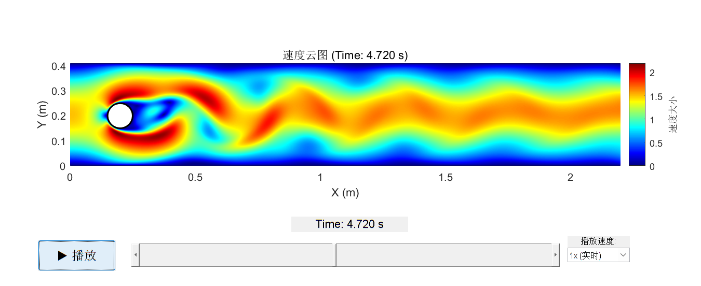
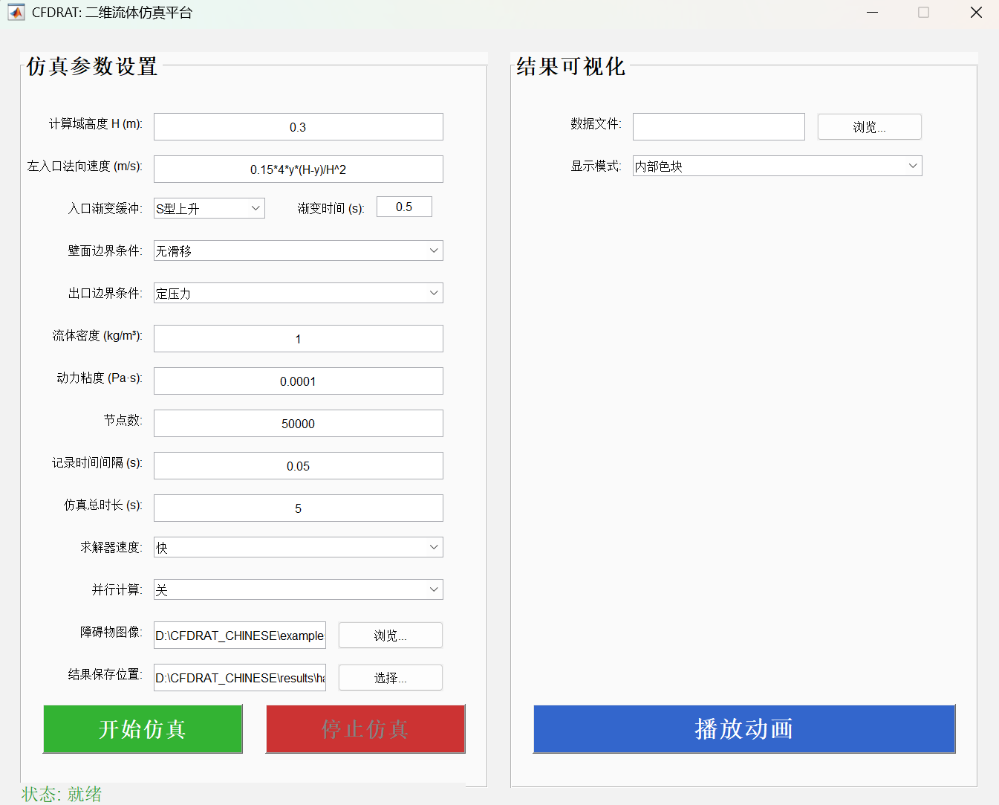
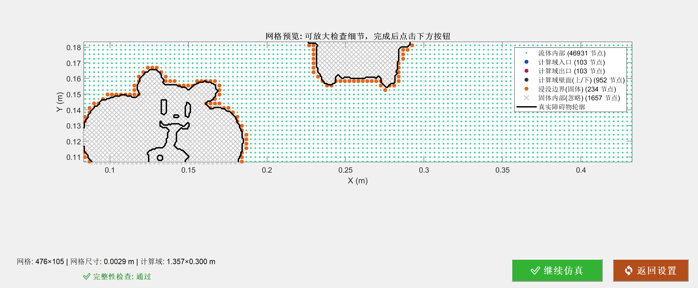

# CFDRAT - 用户指南


## 1. 基本概念

个人力量有限，CFDRAT只实现在特定场景的仿真：

*   **计算域**

    计算域为一个二维矩形。其物理高度 `H` 由您设定。其宽度将根据您提供的障碍物图像的宽高比自动确定。

*   **边界条件**
    *   **左侧入口**: 采用速度入口，可以通过一个数学表达式定义速度剖面。
    *   **右侧出口**: 采用恒定压力出口，允许流体自然地流出。
    *   **上下壁面**: 可选无滑移或滑移条件。
    *   **障碍物**: 采用无滑移边界条件。
    
    如经典圆柱绕流案例：
   <p align="center">
   
   </p>


*   **计算网格**

    采用结构化网格对计算域进行离散。网格的疏密由 `节点数` 决定。

*   **识别物体**

    使用轮廓清晰、少毛刺、无四周边框的图片。

---

## 2. 快速上手：完成一次仿真

### **第一步：启动GUI**
打开MATLAB，将当前路径切换到本项目所在文件夹 `CFDRAT/`，在命令行窗口输入以下命令并按回车：
  ```matlab
cfdrat()
```
打开CFDRAT的GUI界面。
<p align="center">
  
</p>

### **第二步：设置参数**
若想要复现README中的绕流，则直接使用界面的默认参数与路径，点击绿色 **`开始仿真`** 按钮。程序自动生成网格并展示，点击 **`开始仿真`** 。

<p align="center">
  
</p>

若想自由设置则需：
1.  在左侧面板，设置 `计算域高度 H`、`入口速度` 等核心参数。
2.  点击 **`障碍物图像`** 旁边的“浏览...”按钮，选中任意一张图片。
3.  点击 **`结果保存位置`** 旁边的“选择...”按钮，选择一个文件夹并提前命名存储的.mat数据
### **第三步：结果可视化**

仿真结束后：
1.  在右侧面板，点击 **`数据文件`** 旁边的“浏览...”按钮。
2.  找到并选中刚刚生成的.mat文件。
3.  点击 **`播放动画`** 按钮，一个新的窗口将会弹出，开始播放您的流场动画


## 3. 参数设置

### **仿真参数设置面板**

此面板包含了运行一次仿真所需的所有输入参数。

*   **`计算域高度 H (m)`**: 矩形仿真区域的物理高度。计算域的宽度将根据图像的宽高比自动确定。

*   **`左入口法向速度 (m/s)`**: 用一个数学表达式来定义流体从左侧边界流入的速度剖面。
    *   可用变量: 使用 `t` (当前时间, 秒), `y` (垂直坐标, 从0到H), 和 `H` (设定的高度)。
    *   默认值: `0.15*4*y*(H-y)/H^2` 是个经典的抛物线型速度。

*   **`入口渐变缓冲`**: 避免仿真开始时的速度突变，要设定一个小的缓冲时间，在该时间上升到设定值。
    *   **`S型上升`**: smoothstep函数。
    *   **`线性上升`**: 斜坡函数。
    *   **`无`**: 不缓冲，速度在t=0时瞬间达到设定值。

*   **`壁面边界条件`**: 定义了流体与上下壁面的相互作用。
    *   **`无滑移`**: 流体在紧贴壁面处的速度为零。
    *   **`滑移`**: 流体可以在壁面无摩擦地滑动。

*   **`出口边界条件`**: 固定为定压力出口，这是最稳健的出流边界条件，流体可自由流出计算域。

*   **`流体密度 (kg/m³)`**: 流体的质量属性。常温水的密度约为1000，空气约为1.2。

*   **`动力粘度 (Pa·s)`**: 流体的“粘稠”程度。水的动力粘度约为0.001。

*   **`节点数`**: 网格总数，计算时间复杂度是O(n^2)，对于普通笔记本电脑，50000是一个很好的起点，100000以上计算量剧增 。

*   **`记录时间间隔 (s)`**: 软件会每隔这么长时间保存一帧动画结果。

*   **`仿真总时长 (s)`**: 您希望模拟的物理世界总时间。

*   **`求解器速度`**: 程序会根据CFL数计算合适的时间步长，无需自主设置。
    *   **`快`**: 使用较大的CFL数，时间步长更大，计算快。
    *   **`中`**: 使用较保守的CFL数，时间步长更小，计算稳健。

*   **`并行计算`**: 根据经验，在十万节点规模下，不建议开，异步通信时间较长

*   **`障碍物图像`**: 点击“浏览...”选择一张图像。程序会自动识别闭合图像。

*   **`结果保存位置`**: 点击“选择...”来指定一个路径和文件名，用于保存包含所有仿真结果的`.mat`文件。


### **结果可视化面板**

此面板用于播放和分析已完成的仿真结果。

*   **`数据文件`**: 点击“浏览...”选择一个之前仿真生成的`.mat`结果文件。

*   **`显示模式`**: 控制动画中障碍物的显示方式。
    *   **`内部色块`**: 会将您选择的障碍物原始图片贴在流场中
    *   **`仅边界`**: 只绘制障碍物的轮廓线

*   **`播放动画`**: 加载所选数据文件，并弹出一个新的窗口播放交互式流场动画。动画播放器带有播放/暂停、时间轴拖动和速度调节功能。

---

## 4. 其他参数

### **雷诺数**

雷诺数是流体力学中最重要的无量纲数，它代表了惯性力与粘性力的比值。它决定了流动的形态：
*   低雷诺数: 流动平稳、有序（层流）。
*   高雷诺数: 流动混乱、无序（湍流）。

本求解器为层流求解器，为了保证数值稳定性与模拟的真实性，内部设置了雷诺数上限（约`300`）。如果您设置的**入口速度**或**密度**过高，或者**粘度**过低，计算出的雷诺数超限，程序会报错并提示您调整参数。

### **CFL条件**

*   `节点数` 决定了网格边长`h`。
*   `求解器速度` 、`入口速度`和**`网格边长`** 共同决定了时间步长`dt`。

这三者之间存在制约关系（CFL条件），即在一个时间步内，流体微团不应“穿越”超过一个网格。本程序会自动计算稳定的`dt`，您只需要通过调整`节点数`和`求解器速度`来平衡对精度和速度的需求。

## 5. 仿真数据

当一次仿真结束后，指定的 `.mat` 打包了所有相关的元数据。使用MATLAB的 `load` 命令加载 `.mat` 文件后，您将在工作区得到一个名为 **`info`** 的结构体。
 
**`info`** 结构体包含以下核心字段：
 
*  **`info.h`**: 网格边长 
*  **`info.u_all`**, **`info.v_all`**，**`info.p_all`**:x方向速度场、y方向速度场和压力场数据，以网格形式存放。是三维数组，维度为 `[y方向节点数Ny, x方向节点数Nx, 时间帧数]`。
* **`info.XX`**：由物理量在网格上的x坐标。
* **`info.YY`**：由物理量在网格上的y坐标。
*   **`info.T_record`**: 记录时间间隔 (s)。
*   其他元数据: 如 `dt` (模拟时间步长), `t_simu` (总时长), `node_scale` (节点数) 等所有参数都被保存。


